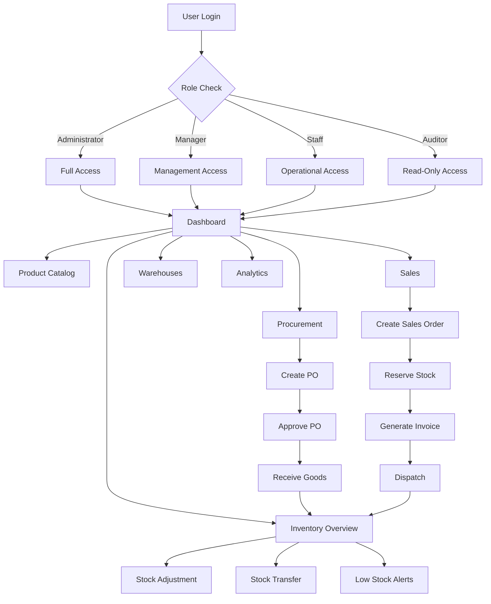
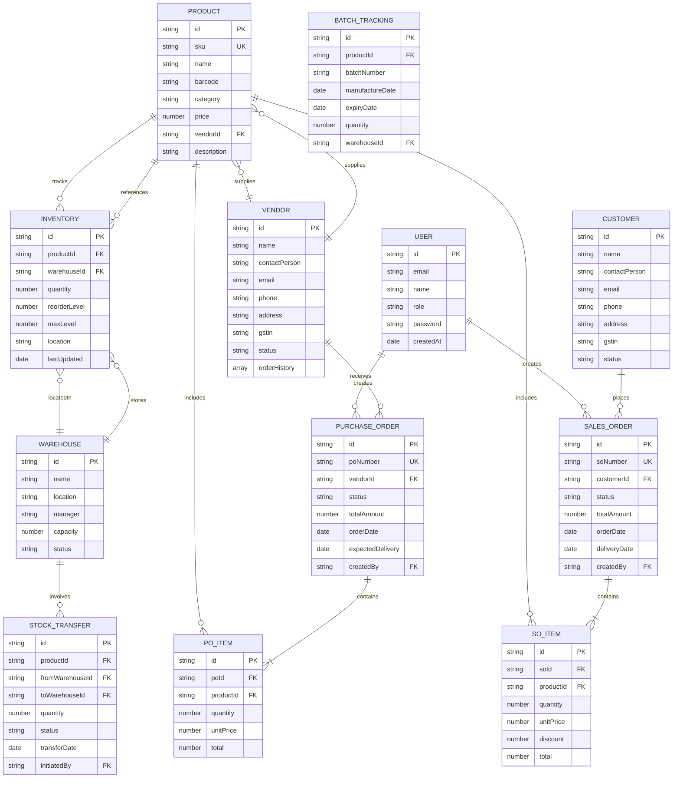
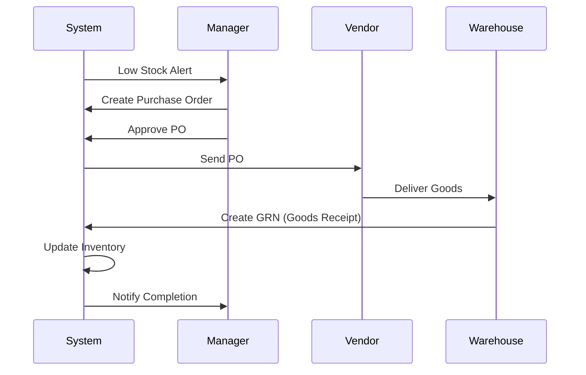
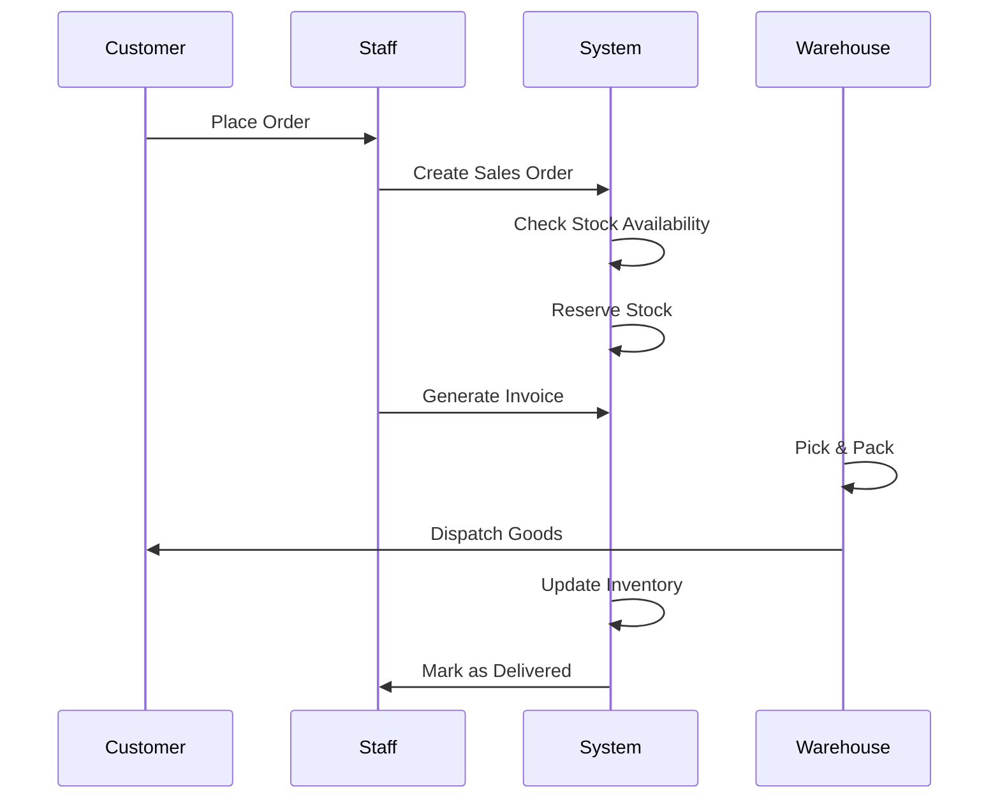

# InventoryPro System Diagrams

## User Journey Flow

## Entity Relationship Diagram

## Stock Replenishment Process

## Order Fulfillment Process

## How to Use These Diagrams

You can use this mermaid code in:
- **Mermaid Live Editor**: https://mermaid.live
- **GitHub**: Paste in markdown files (GitHub renders mermaid)
- **Notion**: Supports mermaid diagrams
- **VS Code**: Use Mermaid preview extensions
- **Draw.io**: Import mermaid code
- **Documentation sites**: Most support mermaid syntax

To export as images:
1. Visit https://mermaid.live
2. Paste the code
3. Click "Actions" → "Export PNG/SVG/PDF"
